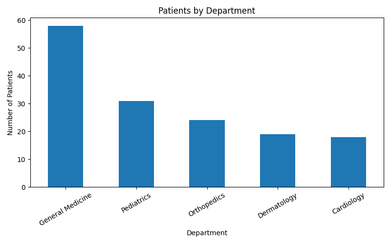
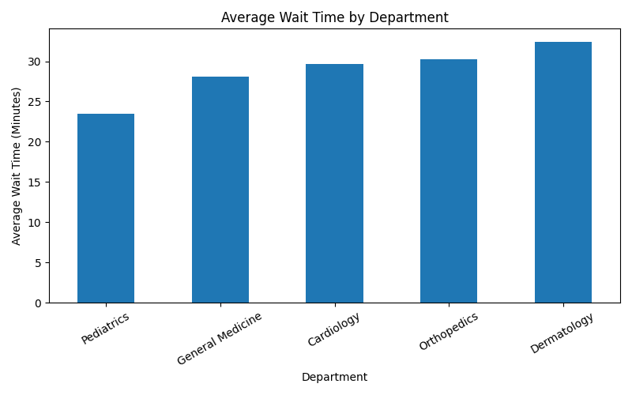
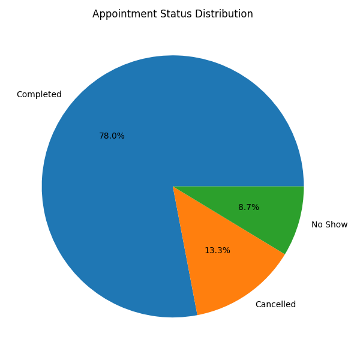

# 🏥 Afrinex AI – Healthcare Data Analysis & Insights

## 📊 Overview
This project analyzes healthcare data to uncover insights into patient flow, wait times, and clinic performance. The goal is to support data-driven decision-making in healthcare environments.

---

## 🎯 Objectives
- Analyze patient visits across departments
- Identify trends in wait times and service demand
- Evaluate appointment outcomes (completed, cancelled, no-show)
- Provide insights to improve clinic efficiency

---

## 🛠️ Tools & Technologies
- Python
- Pandas
- Matplotlib
- Jupyter Notebook

---

## 📈 Key Insights
- General Medicine handled the highest patient volume
- Wait times varied significantly across departments
- No-shows and cancellations impacted efficiency
- Payment methods showed a mix of cash, insurance, and mobile usage

---

## 📊 Visualizations

### Patients by Department

### Average Wait Time by Department

### Appointment Status Distribution

